# About imageRy

The **`imageRy`** package was designed as an educational resource to
facilitate learning the basics of remote sensing analyses in R,
particularly for users with limited programming experience. `imageRy`
provides a dedicated set of example data and simplified versions of
functions commonly used in remote sensing workflows. More specifically,
`imageRy` implements functions to deal with data **import** and
**export**, **data visualization**, and **data analysis**. In this
vignette, we will go through each function implemented in `imageRy`,
illustrating their use with the example data included in the package.
All the functions of the package contain the suffix **`im.`** so that
users are always aware of the functions linked to `imageRy`.

## 1. Packages needed and package installation

The main dependency of `imageRy` is the **`terra`** package, from which
several functions are derived. In this vignette, we will also use
**`viridis`** for colorblind-friendly palettes in some plots.

`imageRy` can be installed via function `install_github()`:

    devtools::install_github("ducciorocchini/imageRy")

After the installation, we can load all the packages needed in this
vignette:

    library(imageRy)
    library(terra)
    library(viridis)

The correct installation and loading of `imageRy` can be verified with
function **`im.print()`**:

    im.print()

    ## [1] "I am imageRy"

## 2. Data import

One of the most challenging tasks is related to a proper import and
export of data. To overcome this, `imageRy` provides for data directly
inside the package. To list all raster images stored in `imageRy` we can
simply call function **`im.list()`**:

    im.list()

    ##  [1] "bletterbach.jpg"                                   
    ##  [2] "dolansprings_oli_2013088_canyon_lrg.jpg"           
    ##  [3] "EN_01.png"                                         
    ##  [4] "EN_02.png"                                         
    ##  [5] "EN_03.png"                                         
    ##  [6] "EN_04.png"                                         
    ##  [7] "EN_05.png"                                         
    ##  [8] "EN_06.png"                                         
    ##  [9] "EN_07.png"                                         
    ## [10] "EN_08.png"                                         
    ## [11] "EN_09.png"                                         
    ## [12] "EN_10.png"                                         
    ## [13] "EN_11.png"                                         
    ## [14] "EN_12.png"                                         
    ## [15] "EN_13.png"                                         
    ## [16] "greenland.2000.tif"                                
    ## [17] "greenland.2005.tif"                                
    ## [18] "greenland.2010.tif"                                
    ## [19] "greenland.2015.tif"                                
    ## [20] "info.md"                                           
    ## [21] "iss063e039892_lrg.jpg"                             
    ## [22] "matogrosso_ast_2006209_lrg.jpg"                    
    ## [23] "matogrosso_l5_1992219_lrg.jpg"                     
    ## [24] "NDVI_rainbow_legend.png"                           
    ## [25] "NDVI_rainbow.png"                                  
    ## [26] "S2_AllBands_temperate_passo_falzarego.tif"         
    ## [27] "S2_AllBands_tropical.tif"                          
    ## [28] "sentinel.dolomites.b2.tif"                         
    ## [29] "sentinel.dolomites.b3.tif"                         
    ## [30] "sentinel.dolomites.b4.tif"                         
    ## [31] "sentinel.dolomites.b8.tif"                         
    ## [32] "sentinel.png"                                      
    ## [33] "Sentinel2_NDVI_2020-02-21.tif"                     
    ## [34] "Sentinel2_NDVI_2020-05-21.tif"                     
    ## [35] "Sentinel2_NDVI_2020-08-01.tif"                     
    ## [36] "Sentinel2_NDVI_2020-11-27.tif"                     
    ## [37] "Solar_Orbiter_s_first_views_of_the_Sun_pillars.jpg"

These files can be imported using **`im.import()`**. In this vignette,
to explore all the package functions, we will import four bands from a
Sentinel-2 Level-2A image of an area of the Dolomites in Italy. A more
detailed description of the data contained in the `imageRy` package is
provided at
<https://github.com/ducciorocchini/imageRy/blob/main/data_description.md>.

It is possible to import single images by specifying the exact name of
the file, or, as in this case, import all images with the same specified
pattern, as long as they share the same extent, resolution and
coordinate reference system. After importing the images, an automatic
plot is also provided. For convenience, we will also rename the band
layers.

    dolom <- im.import("sentinel.dolomites")

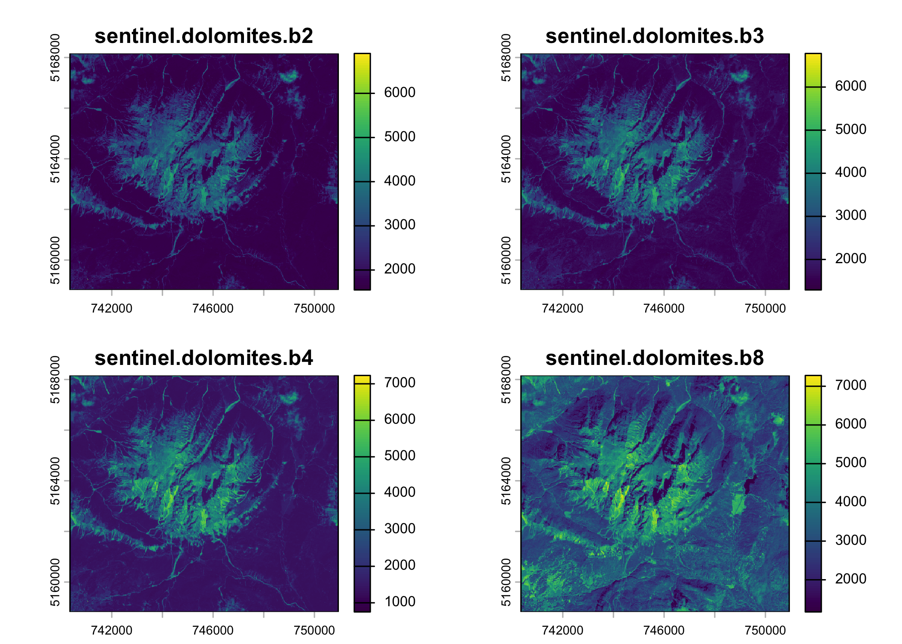

    names(dolom) <- c("B2", "B3", "B4", "B8")

Typing the name of the created object will return all the information of
the image, including in this case: the class (which is a `SpatRaster`,
being based on the `terra` package), the dimensions of the image, its
resolution, the extent, the coordinate system, the sources, the layer
names, and the minimum and maximum values.

    dolom

    ## class       : SpatRaster 
    ## size        : 934, 1059, 4  (nrow, ncol, nlyr)
    ## resolution  : 10, 10  (x, y)
    ## extent      : 740350, 750940, 5158820, 5168160  (xmin, xmax, ymin, ymax)
    ## coord. ref. : WGS 84 / UTM zone 32N (EPSG:32632) 
    ## sources     : sentinel.dolomites.b2.tif  
    ##               sentinel.dolomites.b3.tif  
    ##               sentinel.dolomites.b4.tif  
    ##               sentinel.dolomites.b8.tif  
    ## names       :   B2,   B3,   B4,   B8 
    ## min values  : 1338, 1293,  750, 1159 
    ## max values  : 6903, 6780, 7229, 7313

## 3. Data visualization

This section introduces all `imageRy` functions for visualizing raster
and multispectral image data, including functions to display images as
RGB composites, arrange multiple plots, map individual raster layers,
and explore the distribution of pixel values across bands. More advanced
visualizations are also presented, including bivariate maps, pairwise
comparisons among image layers, and level plots. Together, these tools
provide a first visual exploration of image structure, spectral
patterns, and spatial variation before moving to further analyses.

### 3.1 Manual RGB visualization with `im.plotRGB()`

Multispectral images can be visualized in `imageRy` through **RGB
composites**. In this type of representation, three bands of the image
are assigned to the red, green, and blue channels of the plot.

The function **`im.plotRGB()`** allows the user to **manually choose**
which bands should be assigned to the red, green, and blue channels. For
example, in the Dolomites image, the first band (`B2`) is the blue, the
second (`B3`) is the green, the third (`B4`) is the red, and the fourth
(`B8`) is the near-infrared. To have a true color composition of the
Dolomites image we can plot it as:

    im.plotRGB(dolom, r = 3, g = 2, b = 1, title = "Dolomites - True colors")

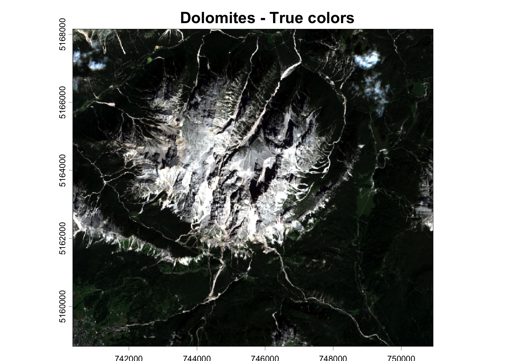

### 3.2 Automatic RGB visualization with `im.plotRGB.auto()`

For a quicker first exploration of an image, function
**`im.plotRGB.auto()`** **automatically** uses the first three bands of
the image to build an RGB plot, without requiring the user to manually
specify band positions:

    im.plotRGB.auto(dolom, title = "Dolomites - Automatic RGB plot")

### 3.3 Multi-frame plot layout with `im.multiframe()`

**`im.multiframe()`** sets up a **multi-frame plotting layout** using
`par(mfrow = c, y))`, allowing the display of multiple plots in a grid
format. For example:

    im.multiframe(1, 2)
    im.plotRGB(dolom, r = 4, g = 1, b = 3, title = "Dolomites - False colors")
    im.plotRGB.auto(dolom, title = "Dolomites - Automatic RGB plot")

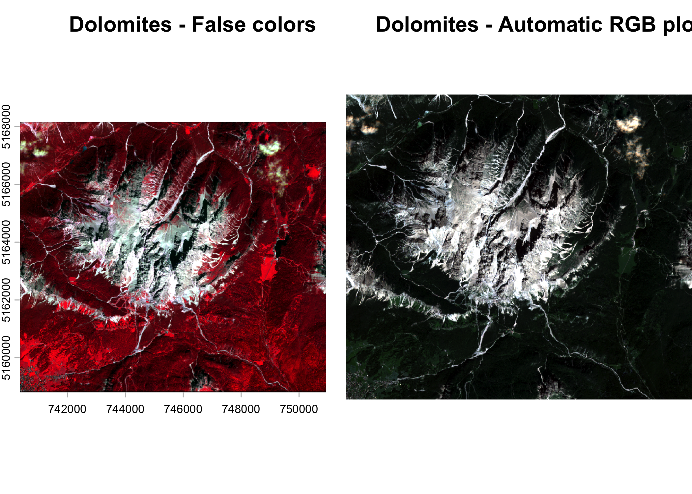

### 3.4 Raster visualization with `im.ggplot()`

**`im.ggplot()`** allows the visualization of a single raster layer
through **`ggplot2`**. This function converts a `SpatRaster` object into
a data frame with spatial coordinates and raster values, and then plots
it using a `viridis` color scale. By default, the first layer of the
raster is used:

    im.ggplot(dolom)

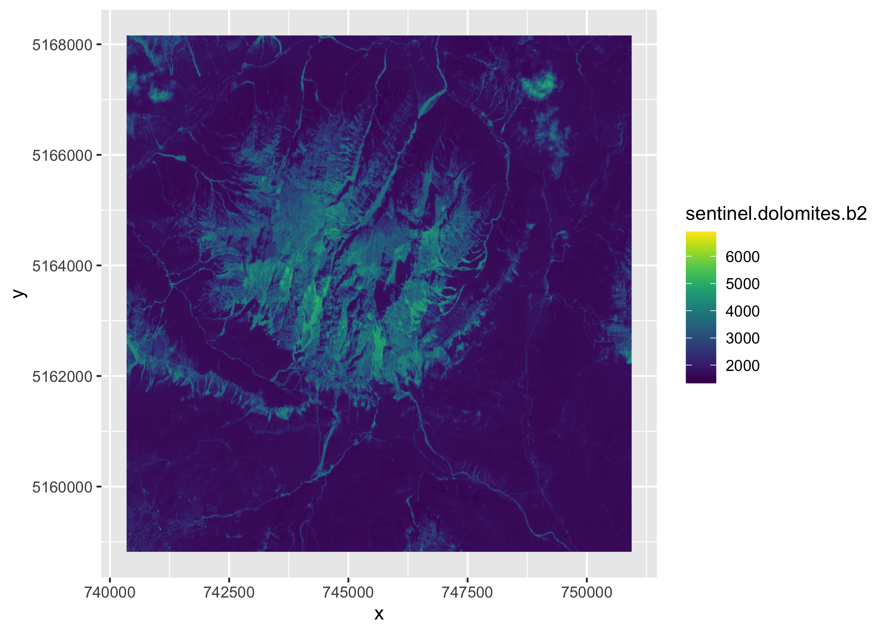

Since `dolom` is a multilayer image, a specific band can also be
selected through the `layerfill` argument. For example, to visualize the
second layer:

    im.ggplot(dolom, layerfill = 2)

In contrast to `im.plotRGB()` and `im.plotRGB.auto()`, which directly
generate base R plots, `im.ggplot()` returns a `ggplot` object. This
makes it possible to further customize the figure using the tools
available in `ggplot2`.

### 3.5 RGB visualization with `im.ggplotRGB()`

Finally, we can create publication-ready RGB composite plots starting
from a `terra SpatRaster` using `ggplot2` with function
**`im.ggplotRGB()`**. In this case, we can manually select bands to
assign to the red, green and blue channels:

    im.ggplotRGB(dolom, r = 2, g = 3, b = 1)

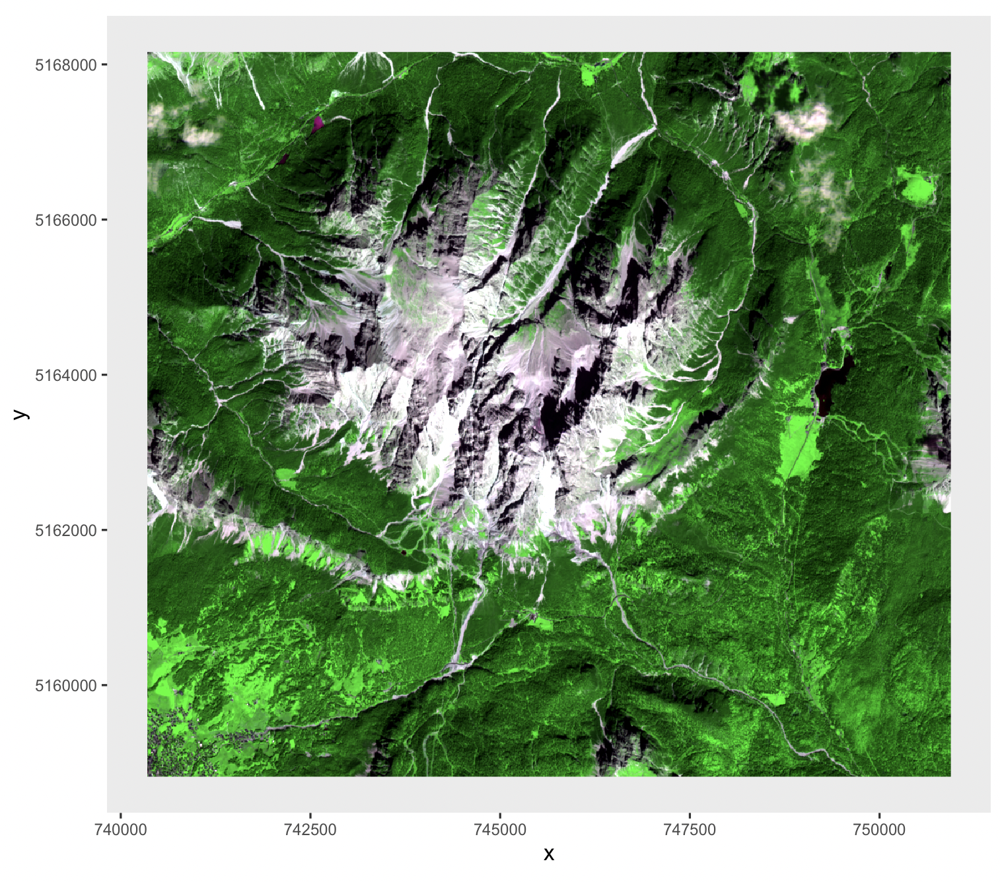

### 3.6 Distribution of raster values with `im.ridgeline()`

**`im.ridgeline()`** is designed to compare the distribution of raster
values across multiple layers. This function generates **ridgeline
plots** (i.e., graphs that show the distribution of a variable across
multiple groups by stacking density curves one above the other) from
stacked satellite data, extracting raster values and displaying their
distribution for each layer.

The function requires a `SpatRaster` object and a `scale` argument
controlling the vertical scaling of the ridgeline curves. A color
palette can also be selected among several `viridis` options.

    im.ridgeline(dolom, scale = 2, palette = "magma")

    ## Picking joint bandwidth of 31.6

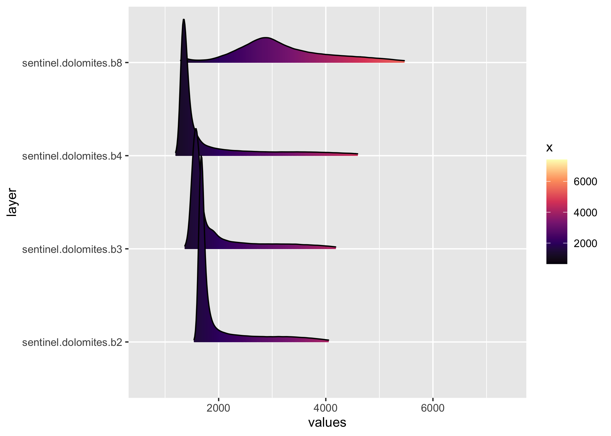

It is possible to reverse the order of the colors in the palette
specifying argument `direction = -1`.

    im.ridgeline(dolom, scale = 2, palette = "magma", direction = -1)

    ## Picking joint bandwidth of 31.6

### 3.7 Bivariate mapping with `im.bivariate()`

**Bivariate maps** are useful for visualising the spatial relationship
between two raster layers. In our example, rather than displaying one
band at a time, with **`im.bivariate()`** we can combine two raster
layers in a single map, assigning each pixel to a class based on its
values in both bands, making it possible to highlight areas where two
bands show similar or diverging reflectance patterns.

The core packages used to build the function are `biscale`, which
provides the functions to classify the two variables into bivariate
classes and map them, and `cowplot`, used to assemble the final figure.

The function takes as input two `SpatRaster` objects with the same
geometry. Arguments `xlab` and `ylab` specify the labels displayed on
the axes of the legend. `dim` defines the dimension of the palette. For
example, `dim = 3` produces a 3 x 3 classification, corresponding to 9
classes in total. Finally, with `custom_colors` it is possible to supply
color palettes. This can either the name of one of the built-in
`biscale` palettes, like the one we are using in this example (more at:
<https://cran.r-project.org/web/packages/biscale/vignettes/bivariate_palettes.html>),
or a custom vector of colors.

Here we compare the red band (`B4`) and near-infrared band (`B8`), as
their relationship is often informative for interpreting vegetation
patterns.

    im.bivariate(
      r1 = dolom[["B4"]],
      r2 = dolom[["B8"]],
      xlab = "Red band",
      ylab = "NIR band",
      custom_colors = "DkBlue2",
      dim = 3
      )

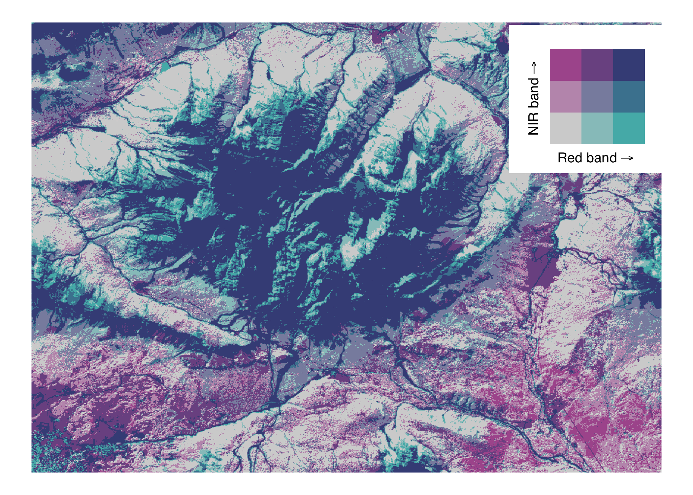

### 3.8 Pairwise raster comparison with `im.pairs()`

**`im.pairs()`** provides a compact way to explore pairwise
relationships among the layers of a multi-band raster image. The
function produces a matrix of plots in which each raster layer is
compared with all the other: on the diagonal, **density plots** show the
distribution of values for each layer; in the lower triangle,
**scatterplots** show the relationship between pairs of bands; in the
upper triangle, **bivariate maps** show where these relationship occur
spatially.

The function takes as input a multi-layer `SpatRaster`. The `color`
argument controls the color used for the density plots and the
scatterplots. The `sample_pixels` argument can be used to reduce the
number of pixels used to build the density plots and scatterplots, and
compute the statistical summaries. When `sample_pixels = NULL`, all
non-`NA` pixels are used. For large raster images, this can be
computationally expensive and may produce very dense scatterplots.
Setting, for example, `sample_pixels = 5000` randomly selects 5000
pixels from the image, making the function faster while still preserving
the general shape of the relationships among bands. When sampling is
used, the reported `R²` and *p*-values are calculated on the sampled
pixels.

    im.pairs(dolom, 
             color = "black", 
             sample_pixels = 5000
             )

The additional arguments of `im.pairs()` are related to the bivariate
maps and are the same present in `im.bivariate()`. They control the
appearance of the bivariate maps shown in the upper triangle of the plot
matrix, including the color palette, the number of classes in the
bivariate scheme, and the position, size, and text formatting of the
embedded legends. In practice, these arguments allow the user to adjust
the bivariate-map component of `im.pairs()` in the same way as when
working directly with `im.bivariate()`.

    im.pairs(
      dolom,
      color = "slateblue4",
      bivariate_color = "DkBlue2",
      sample_pixels = 5000
    )

### 3.9 Raster level plots with `im.levelplot()`

The `im.levelplot()` function provides a simple interface for
visualising one or more layers of a `SpatRaster` object using **level
plots**. Level plots represent raster values with a continuous colour
scale, making them useful for exploring the spatial distribution of
pixel values in single-band or multi-band images.

`im.levelplot()` is based on the `rasterVis::levelplot()` function. It
takes as input a `SpatRaster`: when a multi-layer image is provided,
each layer is displayed as a separate panel, allowing quick visual
comparison among bands.

    im.levelplot(dolom, custom_colors = "viridis")

A specific layer can also be selected using the `layer` argument, either
by index or by name. Users can choose a colour palette with argument
`custom_colors`, which supports both `viridis` and custom palettes. When
a `viridis` palette is supplied, it is possible to choose its direction
with argument `direction`. It is also possible to add contour lines with
argument `contour`, control the layout of multi-layer plots with `ncol`,
and customise the plot and legend titles. For single-layer plots,
`im.levelplot()` can also display marginal summaries using the `margin`
argument, which can be set to either `"mean"` or `"median"`.

    im.levelplot(dolom, layer = 4, custom_colors = "mako", direction = -1, margin = "median")

    im.levelplot(dolom, layer = 4, custom_colors = "mako", direction = -1, margin = "median", contour = TRUE)

## 4. Data analysis

After importing and visualizing raster images, the next step is to
extract information from them through simple analytical tools. In
`imageRy`, data analysis includes the calculation of spectral indices,
unsupervised image classification, fuzzy classification, multivariate
analysis, and moving window operations.

### 4.1 Spectral indices

**Spectral indices** allow condensing information from two or more
raster bands into a single layer. In `imageRy`, two vegetation indices
are available: the **Difference Vegetation Index (DVI)** and the
**Normalized Difference Vegetation Index (NDVI)**. Both indices are
based on the relationship between **near-infrared** and **red**
reflectance, and are commonly used to describe vegetation condition.

In remote sensing, healthy vegetation typically shows high reflectance
in the near-infrared band and low reflectance in the red band. For this
reason, combining these two bands into spectral indices provides a
simple way to highlight vegetated areas and differences in vegetation
status.

#### 4.1.1 The Difference Vegetation Index (DVI) with `im.dvi()`

The DVI is the simplest of the two indices and is calculated as:

*D**V**I* = *N**I**R* − *R**E**D*

where *N**I**R* is the reflectance in the near-infrared band and
*R**E**D* is the reflectance in the red band. Higher values generally
indicate denser and healthier vegetation. In `imageRy`, this index can
be calculated with the function **`im.dvi()`**, which requires a
`SpatRaster` object together with the positions of the near-infrared and
red bands.

For the Dolomites image, where the near-infrared band is in position 4
and the red band is in position 3, DVI can be calculated as follows:

    dvi <- im.dvi(dolom, nir = 4, red = 3)

A straightforward plot of the result based on the `viridis` palette can
be done as:

    clviridis <- colorRampPalette(viridis(7))(255) 

    plot(dvi, col = clviridis)

#### 4.1.2 The Normalized Difference Vegetation Index (NDVI) with `im.ndvi()`

The Normalized Difference Vegetation Index (NDVI) is a normalized
version of DVI and is calculated as

$$
NDVI = \frac{{NIR} - {RED}}{{NIR} + {RED}}
$$

Because it is normalized by the sum of the two bands, NDVI ranges from
-1 to 1. High values indicate healthy and dense vegetation, whereas
values around 0 or below are generally associated with bare soil, water,
or low vegetation cover. In `imageRy`, NDVI is calculated with the
function **`im.ndvi()`**, specifying the input image and the positions
of the near-infrared and red bands.

The function can be applied as follows:

    ndvi <- im.ndvi(dolom, nir = 4, red = 3)

    plot(ndvi, col = clviridis)

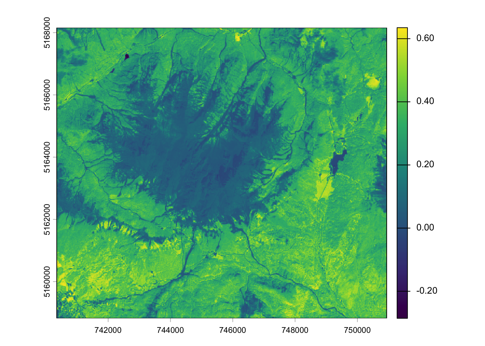

### 4.2 Unsupervised classification with `im.classify()`

The **`im.classify()`** function allows the **classification** of images
using the **k-means** algorithm. The sole parameter required for this
function is the number of clusters (classes) needed. Notice that the
classification process is iteration-based. The numbering of classes can
change, and the final percentage values may show low variability from
one calculation to the other. To allow reproducibility, we can specify
the `seed` argument:

    classes <- im.classify(dolom, num_clusters = 4, seed = 42)

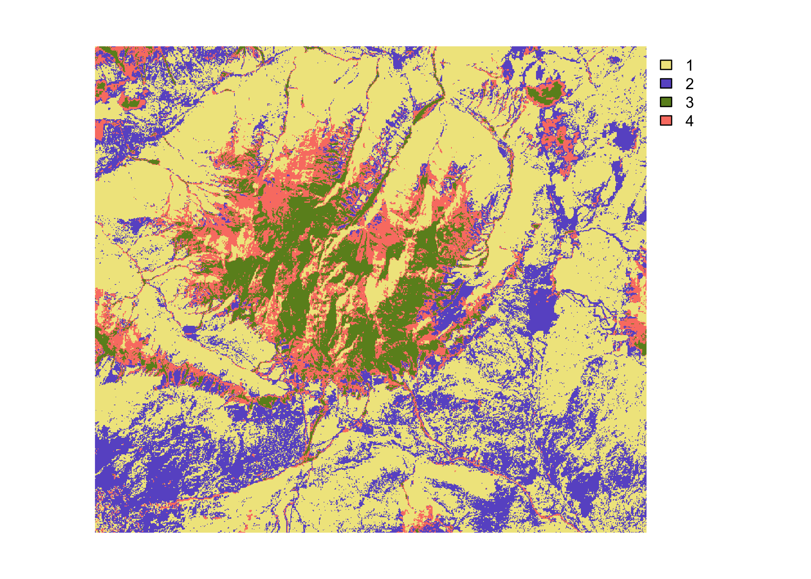

The classified image can be further inspected with functions
`im.boxplot()` and `im.barplot()`. These functions are intended to
visualize the distribution of pixel values across classes and the
relative abundance of each class in a simple and flexible way.

#### 4.2.1 `im.boxplot()`

**`im.boxplot()`** is designed to visualize how pixel values from a
selected raster layer are distributed across the classes. The function
takes two inputs: the original image and the classified raster generated
with `im.classify()`. The layer to be displayed can be selected either
by numeric index or by layer name:

    im.boxplot(dolom, classes, layer = 1)

By default, the function returns a **boxplot** for each class, but there
are several optional arguments. For example, we can add a half-eye
**density plot** by setting the argument `density = TRUE`, to show the
shape of value distribution within each class. We can also display
median values for each class by setting `median_labels = TRUE`, while
the visible y-axis range can be restricted to selected quantiles using
`limits`, and color palettes can be set through the argument
`custom_colors`.

    im.boxplot(dolom, classes, 
               layer = 2, 
               density = TRUE, 
               median_labels = TRUE,
               limits = c(0.01, 0.99),
               custom_colors = viridis::viridis(4, end = 0.5))

#### 4.2.2 `im.barplot()`

`im.barplot()` summarizes the composition of a classified image by
showing how many pixels belong to each class. The function only requires
the classified raster as input. By default, it returns a **barplot** of
the number of pixels in each class.

    im.barplot(classes)

Users can display the **percentage** of pixels in each class instead of
raw counts by setting `perc = TRUE`. **Numerical labels** can be added
above the bars setting `counts = TRUE`. Argument `rescale` allows to
rescale the y-axis from 0 to the total number of pixels if
`perc = FALSE`, or from 0 to 100 if `perc = TRUE`. Colors can be
customized in the same exact way as with `im.boxplot()`.

    im.barplot(classes, 
               perc = TRUE, 
               counts = TRUE,
               rescale = TRUE,
               custom_colors = viridis::viridis(4, end = 0.5))

Just like `im.ggplot()` and `im.ggplotRGB()`, both `im.boxplot()` and
`im.barplot()` return a `ggplot2` object.

### 4.3 Fuzzy classification with `im.fuzzy()`

In some cases, pixels cannot be clearly assigned to a single class,
because their spectral properties are intermediate between different
groups. Instead of assigning each pixel to only one class, **fuzzy
clustering** estimates the degree of membership of each pixel to all
classes. In `imageRy`, this can be done through function
**`im.fuzzy()`**. It first applies k-means clustering to estimate class
centers and then calculates, for each pixel, its membership to each
cluster on the basis of the distance from the cluster centers. The
degree of fuzziness is controlled by the parameter `m`: higher values of
`m` produce smoother and less distinct class memberships. The function
can be applied as follows:

    fuzzy <- im.fuzzy(dolom$B8, num_clusters = 3, m = 2, seed = 42)

The output is a list containing three elements: the distance rasters
(`distances`), the membership rasters (`memberships`), and the matrix of
cluster centers (`centers`):

    plot(fuzzy$distances)

    plot(fuzzy$memberships)

    fuzzy$centers

    ##          B8
    ## 1  50.25857
    ## 2  88.46110
    ## 3 147.10982

### 4.4 Multivariate analysis with `im.pca()`

The information contained in a satellite image is often replicated in
several bands, i.e. there is usually a high **multicollinearity** in the
reflectance among different bands. Multivariate analyses are a valuable
tool for transforming the original set of data into new uncorrelated
axes, to reduce the problem of multicollinearity. **Principal Components
Analysis (PCA)** is implemented in `imageRy` with the function
**`im.pca()`**:

    pc <- im.pca(dolom)

    ## Standard deviations (1, .., p=4):
    ## [1] 1486.07539  526.75366   49.82086   33.21852
    ## 
    ## Rotation (n x k) = (4 x 4):
    ##          PC1        PC2         PC3         PC4
    ## B2 0.4084005  0.2792719  0.86447145  0.08891224
    ## B3 0.4650748  0.2204399 -0.20531063 -0.83244173
    ## B4 0.5838450  0.3923525 -0.45844047  0.54315450
    ## B8 0.5253946 -0.8482175  0.01920928  0.06417613

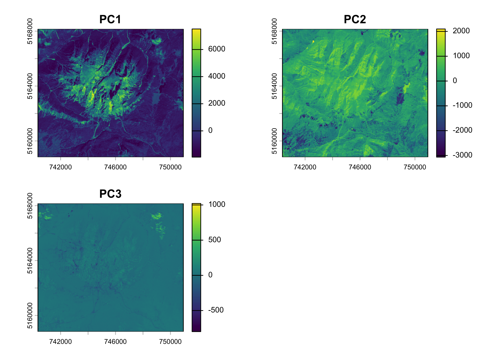

The output shows that the first principal component contains most of the
information in the image, because its standard deviation is much larger
than that of the other components. The second component also captures
part of the variability, while the third and fourth components
contribute much less. The rotation matrix indicates how each original
band contributes to each principal component, and the maps show the
spatial distribution of these new variables.

### 4.5 Moving-window (kernel) statistics with `im.kernel()`

**Moving-window (kernel)** operations basically consist of applying a
square window that moves across the raster, calculating for each focal
pixel a summary statistic based on the values of the surrounding cells.
In `imageRy`, this can be done with function **`im.kernel()`**, which
computes focal statistics on a single-layer `SpatRaster`. The size of
the moving window is controlled by the argument `mw`, whereas the
argument `stat` specifies which statistic should be calculated.

Since `im.kernel()` works on a single-layer raster, we can apply it to a
derived index, such as the `ndvi` object we previously computed.

    ndvi_kernel <- im.kernel(ndvi, mw = 3, stat = c("mean", "sd"))

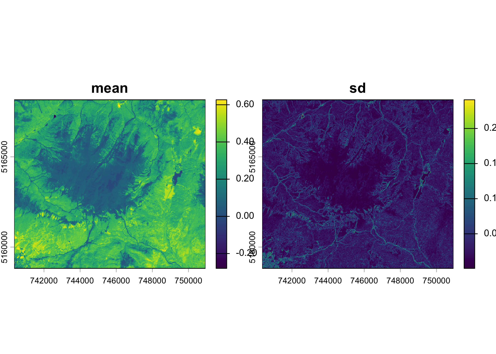

In this example, the function computes the local mean and standard
deviation of `ndvi` within a 3 x 3 moving window.

## 5. Export

Finally, `imageRy` implements function **`im.export()`** that allows to
save a SpatRaster object in GeoTIFF, PNG or JPG format. For example, to
save the `ndvi` object in PNG format, simply do:

    im.export(ndvi, "dolom_ndvi.png")

    ## Raster successfully exported as PNG: dolom_ndvi.png
